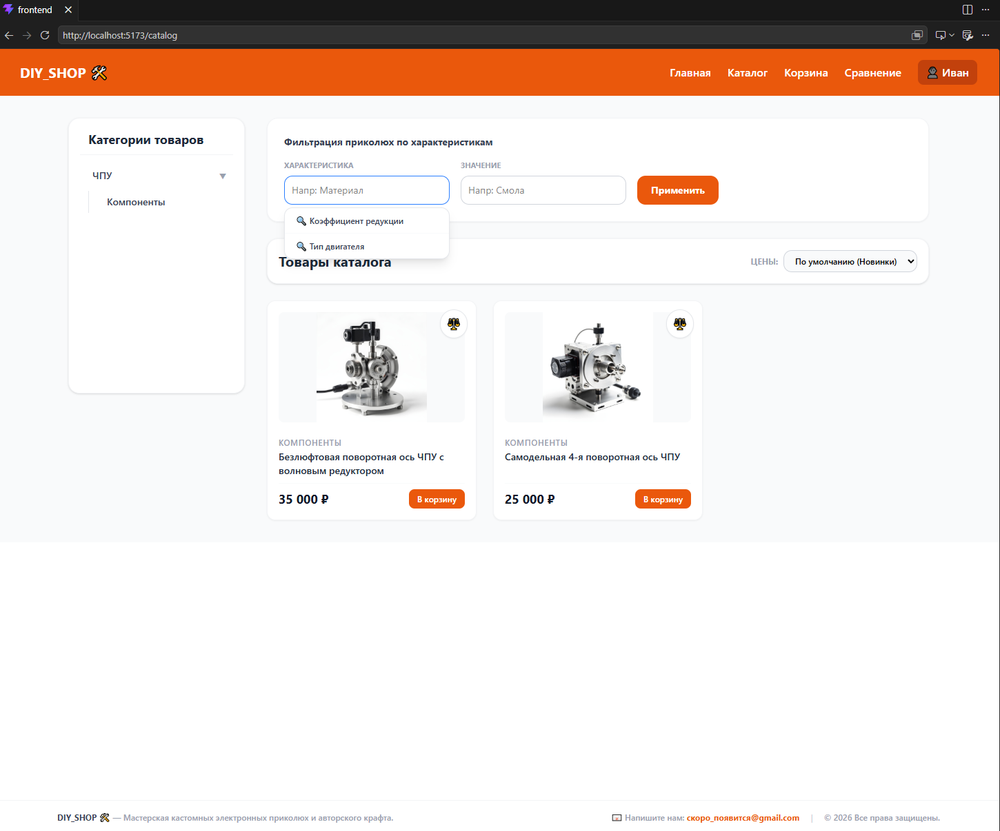
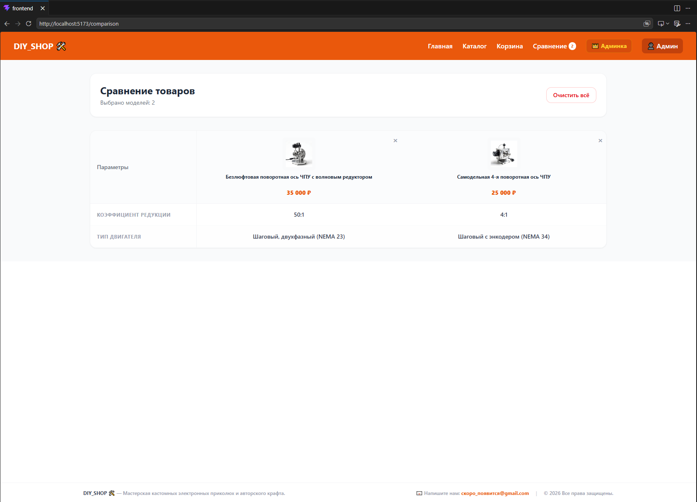
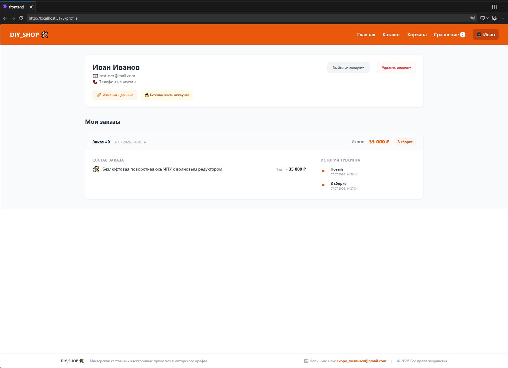
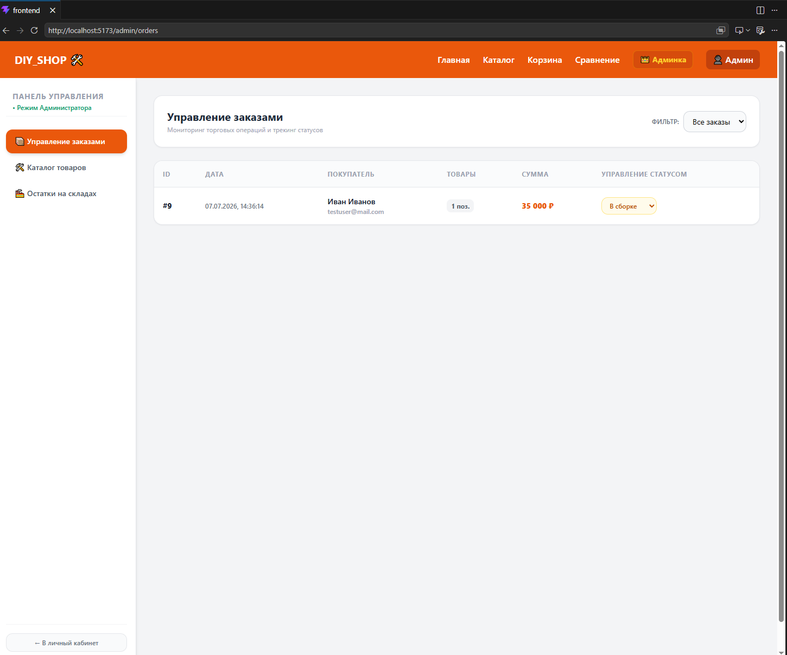
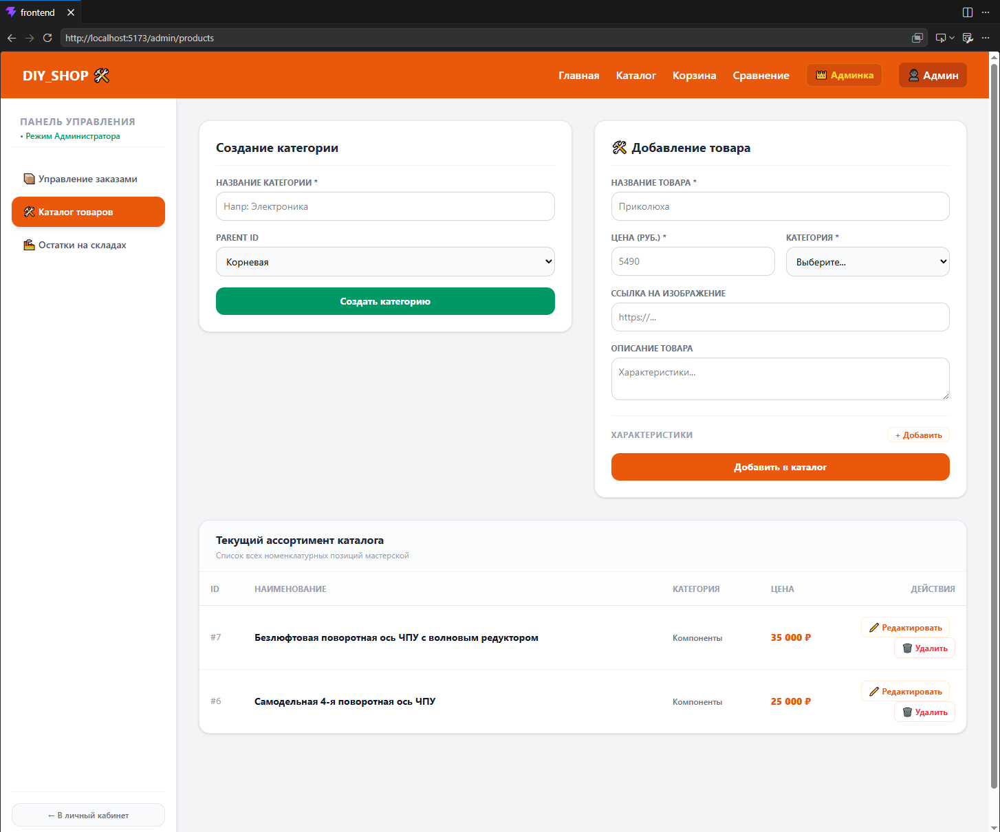
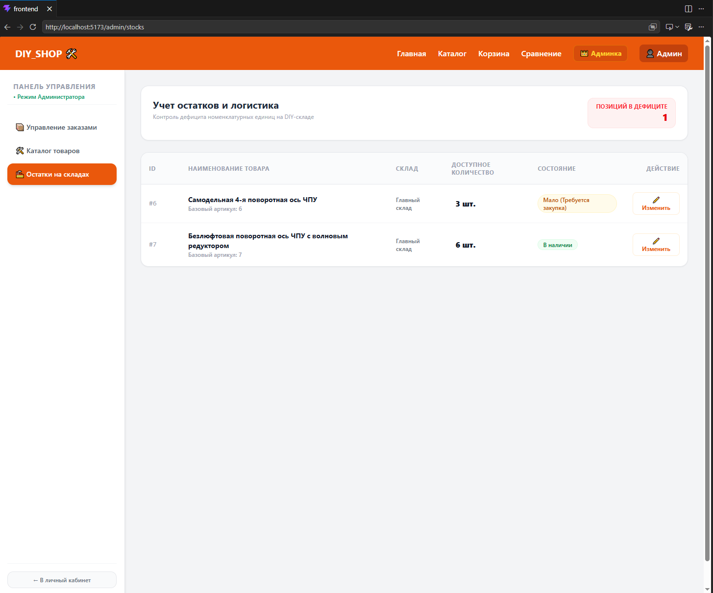

# DIY Shop — Интернет-магазин товаров ручной работы (Портфолио)

Добро пожаловать в репозиторий-витрину проекта **DIY Shop**. 
Исходный код бэкенда (Express, Prisma) и базы данных (PostgreSQL) находится в приватном репозитории в целях безопасности коммерческой логики.

## 📺 Демонстрация работы приложения
* 🚀 **[Смотреть видео-обзор на YouTube](https://youtu.be/GglpTM_aZ8U?si=4MjAymlEESkJeXRH)** — наглядный визуальный обзор интерфейса, работы корзины, процесса оформления заказов и всех разделов админ-панели под фоновую музыку.

## 📸 Скриншоты и ключевой функционал

### 1. Главная страница и каталог

* Эстетичный и минималистичный интерфейс для демонстрации уникальных товаров.

* Динамический вывод продуктов и удобная боковая панель для фильтрации по категориям.

### 2. Пользовательский интерфейс и сравнение

* Раздел интерактивного сопоставления характеристик разных позиций для удобного выбора.

* Личный кабинет покупателя с историей заказов и персональными данными.

### 3. Панель администратора

* Мощный инструмент для менеджера: отслеживание статусов, обработка сценариев оплаты при получении и фиксация кастомных заказов с предоплатой.

* Защищенный интерфейс для быстрого добавления новых товаров, редактирования описаний и изменения цен.

* Контроль остатков на складе и автоматический пересчет доступного количества товаров при совершении покупок.

## 🔒 Архитектура и Безопасность Бэкенда

Серверная часть приложения спроектирована с упором на отказоустойчивость, защиту данных от утечек и строгое разграничение прав доступа. Логика построена по классической многослойной архитектуре: **Маршруты (Routes) -> Валидаторы (Middleware) -> Контроллеры (Controllers) -> Слой данных (Prisma ORM)**.

### 1. Сквозная валидация данных (Слой Middleware)
Для защиты базы данных от некорректных типов, переполнения буфера и базовых инъекций на сервере реализована жесткая пред-валидация каждого входящего запроса:
* **Изоляция на уровне контроллеров:** До того как запрос (`req.body`, `req.query`, `req.params`) попадет в бизнес-логику контроллера, он перехватывается кастомными схемами валидации (в папке `validators/`).
* **Обработка граничных случаев:** Middleware автоматически валидирует форматы email, минимальную/максимальную длину строк для паролей и названий товаров, а также приводит числовые данные (цены, ID, складские остатки) к строгому типу данных. 
* **Безопасный ответ:** В случае некорректного ввода бэкенд прерывает запрос на ранней стадии и возвращает клиенту структурированный JSON-ответ с описанием ошибок, предотвращая падение Node.js.

### 2. Многоуровневая авторизация и сессии (JWT)
Вместо хранения сессий на сервере используется stateless-подход на базе токенов **JSON Web Tokens (JWT)**:
* **Защита маршрутов (Route Guarding):** Доступ к приватным действиям (корзина, профиль, история заказов) закрыт изолирующим `authMiddleware.js`. Он извлекает токен из заголовков запроса (`Authorization: Bearer <token>`) и верифицирует его на стороне сервера с использованием секретного ключа (`JWT_SECRET`).
* **Ролевая модель (RBAC):** Доступ к панели администратора (`backend/routes/adminRoutes`) защищен вторым эшелоном проверок. Проверяется не просто валидность токена, но и конкретная роль пользователя в базе данных (`role === 'ADMIN'`). Обычный пользователь физически не может отправить запрос на изменение остатков товаров или просмотр чужих заказов — сервер вернет ошибку `HTTP 403 Forbidden`.

### 3. Криптографическая защита данных (Bcrypt)
Приложение строго следует стандартам безопасности в отношении хранения конфиденциальных данных пользователей:
* **Хеширование "на лету":** Пароли никогда не передаются и не хранятся в базе данных в открытом (читаемом) виде. 
* **Асимметричное шифрование:** При регистрации пароль прогоняется через криптографическую функцию **Bcrypt** с высоким уровнем вычислительной сложности (солью).
* **Безопасное сравнение:** При авторизации сервер сравнивает введенный текст с хэшем из PostgreSQL с помощью встроенных алгоритмов Bcrypt, что полностью исключает утечку паролей пользователей, даже если злоумышленники получат полный доступ к файлу дампа `diy_shop_db.sql`.

### 4. Оптимизация и слой ORM (Prisma & Express 5)
* **Express 5:** Использование актуальной мажорной версии Express позволяет серверу нативно обрабатывать асинхронные ошибки (промисы) в контроллерах без использования громоздких оберток вроде `try-catch` на каждый чих или сторонних библиотек.
* **Prisma ORM & PostgreSQL:** Общение с базой данных полностью абстрагировано от сырых SQL-запросов. Использование строго типизированных моделей Prisma исключает уязвимости класса **SQL-инъекций**, так как ORM автоматически экранирует любые входящие параметры перед отправкой запроса к СУБД.
